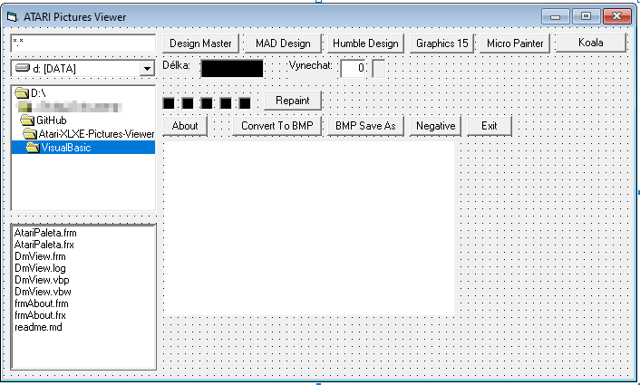

# Atari-XLXE-Pictures-Viewer
 The target of this project was to preview pictures made by 8 bit ATARI XL/XE without using of atari emulator like XFormer or ATARI 800 Win (Altirra was not available at that time).

In 2000 I created a viewer using Visual Basic 5 and brought it to a state where I could use it, so I did not continue with the development. This project is add in VisualBasic directory just to give an idea.

In 2006 I found [Rapid-Q Basic](https://rapidq.phatcode.net "Rapid-Q Basic"), which had a great advantage from my point of view - compiled program depending on used functions didn't need any installed and registered libraries, runtime, etc. The result could be single executable file.

Currently, there are several much better and sophisticated viewers for Atari made pictures as [Recoil](https://recoil.sourceforge.net/ "Recoil") which can display 143 Atari 8 bit formats or [Atari Graphics Studio](https://madteam.atari8.info/index.php?prod=uzytki "Atari Graphics Studio"). My project served me as a training project for Rapid-Q Basic.

## Features - File formats

Generally, viewer can display two colour pictures in GRAPHICS 8 mode, and four colours pictures made in GRAPHICS 3, GRAPHICS 5, GRAPHICS 7 and GRAPHICS 15 modes. Before opening file select appropriate format:

### Design Master

https://www.atarimania.com/utility-atari-400-800-xl-xe-design-master_12516.html

### MAD Designer

MAD designer is graphic editor similar to Design Master, but while Design Master creates pictures with size 320 x 192 pixels (7680 bytes), MAD Designer creates pictures with size 512 x 256 pixels, so file has size 16384 bytes.

http://atari.turiecfoto.sk/soft/mad-designer.zip
http://fileformats.archiveteam.org/wiki/Mad_Designer

### Micro Painter

https://www.atarimania.com/utility-atari-400-800-xl-xe-micro-painter_31609.html

### Koala Micro Illustrator

Koala Micro Illustrator saves pictures into compressed files using 3 ways of compression, so files have size usually less than 7685. There is also add some picture info intoí file. Viewer can unpack all three ways of compressino, but doesn't show picture info.

https://www.atarimania.com/utility-atari-400-800-xl-xe-micro-illustrator_30240.html

### DrawIt

https://www.atarimania.com/utility-atari-400-800-xl-xe-drawit_30485.html

### Fuw With Art

https://www.atarimania.com/utility-atari-400-800-xl-xe-fun-with-art_27410.html

Viewer displays video memory content only. No color changes by DLI (Display List Interrupts) routines are taken into account.

### Proprietary graphics formats for GR.3, GR.5, GR.7 and GR.15

In these file formats the very first 5 bytes represents content of ATARI colour registers on addresses in order 708 - 712. The remainder of file is byte after byte content of ATARI video memory.

Picture in GRAPHICS 3 (40 x 24 pixels, 240 bytes + color registers):

Picture in GRAPHICS 5 mode (80 x 48 pixels, 960 bytes + color registers):

Picture in GRAPHICS 7 mode (160 x 96 pixels, 3840 bytes + color registers):

Picture in GRAPHICS 15 mode (160 x 192 pixels, 7680 bytes + color registers):

### Humble Design

Originally, viewer was supposed to display also images created by [Humble Design](https://github.com/georger420/Atari-XY4150/tree/main/HumPlo) - the only vector graphics editor for ATARI XL/XE I know. For this reason was necessary to have font loaded and use it for displaying picture. Unfortunately, the results of parsing and displaying were not good enough. Circles and arc were crossing other shapes instead of touching only. So Humble design format is disabled. But possibility to load font internaly remained.

### Font files

Viewer can display usual font files having size 1024 bytes. Characters are displayed in normal and "inverse video" style.

## Other features

### Save as Windows Bitmap ("bmp" file)

Use dialog "Soubor" -> "Uložit jako...":

### Colours editing

#### Monochrome

Check the "Monochrome" checkbox:

#### Negative

Check the "Negative" checkbox:

#### Change individual colours

Select and doubleclick on colour register. It will open colour palette dialog:

In palette choose colour and click on that. The background of dialog will change to selected colour.

In palette dialog cklick on OK button:

#### Use custom colour palette

Viewer has built-in colour palette, but there is possible to use different, custom color palette. Go through menu "Nastavení" -> "Paleta barev" -> "Načíst paletu...":

### Features originally planned, but not implemented

Except of Huble Design pictures showing, there were other features planned, but not implemented:

- copy displayed picture to clipboard
- show warnings
- printing pictures
- save picture with changed colors in appropriate Atari format
- ...

## Comments

### Content of repository:

- Atari-Images directory contains pictures in Atari formats
- images directory contains images used in this Readme
- RapidQBasic directory:
    - ABarvy.inc - default built in color palette
    - atariPic21.bas - main program
    - ".act" files are colour palettes
    - defsada.inc - default built in atari font
    - atariPic21.exe - executable file - Use it on your own risk!
- Visual basic directory contains project files of old viewer project in Visual Basic 5

### Compilation

For successfull compilation there are necessary three "includes" files, which are not enclosed to repository due to copyright:

- Rapidq.inc
- QAbout.inc
- QBitmapEx.inc

